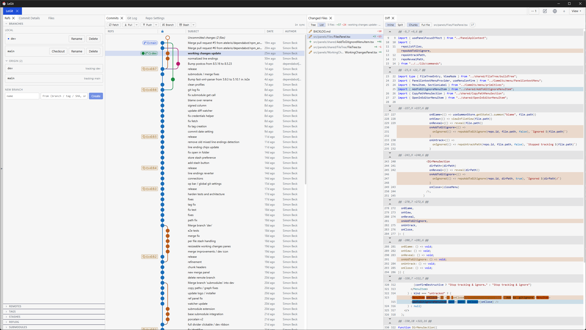

# LeGit

[](https://github.com/ateleris/LeGit/actions/workflows/ci.yml)
[](https://github.com/ateleris/LeGit/releases/latest)

A fast desktop **Git GUI** — a [Tauri 2](https://v2.tauri.app) app with a Rust
backend and a React + TypeScript frontend. LeGit drives the real `git` CLI
rather than reimplementing git, so it works with your existing git config,
hooks, credential helpers, and Git-LFS setup.

<picture>
  <source media="(prefers-color-scheme: dark)" srcset="docs/screenshots/hero_dark.png">
  
</picture>

## Features

- Commit graph, working changes with hunk- and line-level staging, interactive
  rebase, stashes, branches, remotes, tags, reflog.
- Diff viewer (inline + split, editable) with optional syntax highlighting;
  Blame; File History; per-revision File View; a repo-wide Files tree.
- Remote sync (fetch / pull / push) with an in-app credential prompt and git
  identity profiles.
- Fully themeable palette → token system (light + dark); the whole UI scales
  from a single font-size setting.

## Install

### Download (recommended)

Grab the build for your OS from the [Releases](../../releases) page:

| OS | Files |
|----|-------|
| Windows | `.msi`, or `-setup.exe` (NSIS) |
| macOS | `.dmg` |
| Linux | `.AppImage`, or `.deb` |

> Builds are not code-signed yet, so your OS may warn on first launch:
> Windows SmartScreen → **More info → Run anyway**; macOS → right-click →
> **Open**.

### Build from source

Prerequisites:

- [Rust](https://rustup.rs) 1.77+
- [Node.js](https://nodejs.org) 18+
- `git` on your `PATH`
- The [Tauri v2 system prerequisites](https://v2.tauri.app/start/prerequisites/)
  for your OS (WebView runtime, build tools, etc.)

```bash
npm install
npm run tauri dev      # run in development
npm run tauri build    # produce an installer/bundle under src-tauri/target/release/bundle/
```

## Releasing

Version, bundle, and GitHub-release steps live in [RELEASING.md](RELEASING.md).
Tagged releases (`v*`) are built and published automatically by
[`.github/workflows/release.yml`](.github/workflows/release.yml).
